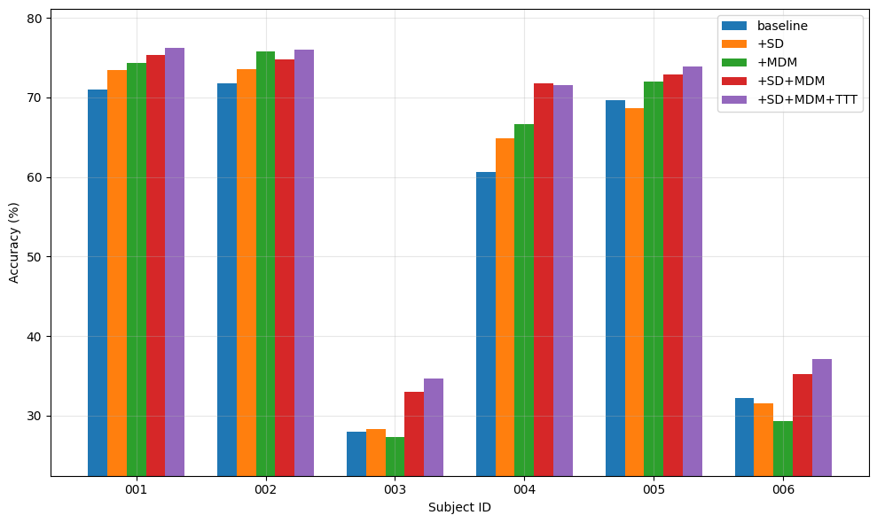
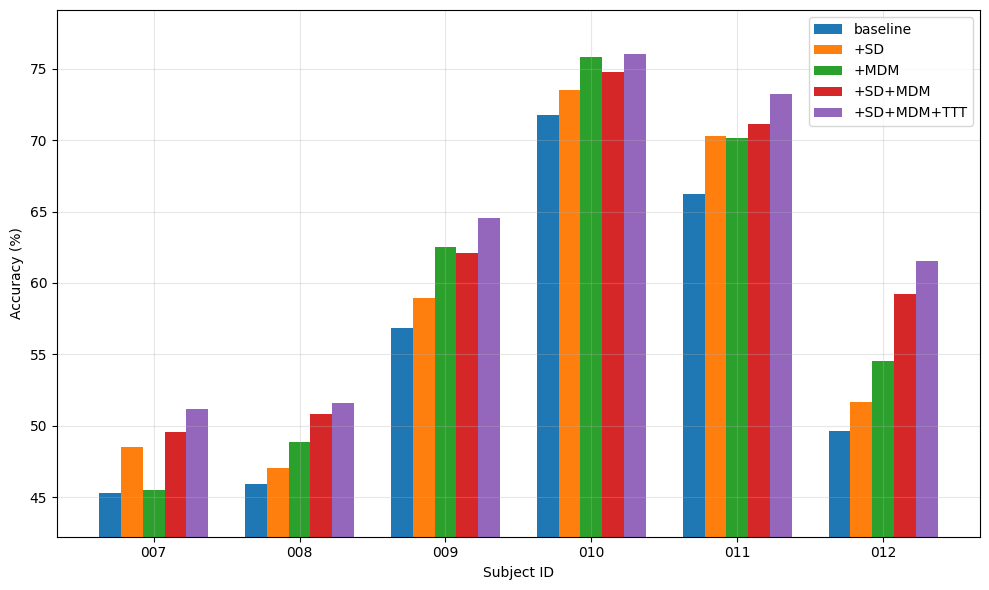

# MDM-TENT

This repository contains the implementation of **MDM-TENT**.

## Results on DU-IN Dataset

The experimental results across all subjects in the **DU-IN** dataset are shown below:

  
  

## Dataset and Environment Setup

You can set up the environment and download the dataset directly from the following repository:  
👉 [Du-IN Dataset Repository](https://github.com/liulab-repository/Du-IN)

